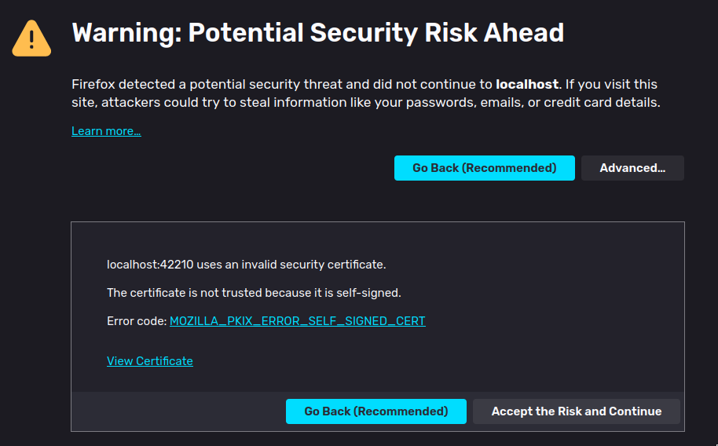

# Actix backend

[![GH_Build_Backend Icon]][GH_Build Status]&emsp;[![License Icon]][LICENSE]

[GH_Build_Backend Icon]: https://img.shields.io/github/actions/workflow/status/1git2clone/reactix/rust-ci.yml?branch=main
[GH_Build Status]: https://github.com/1git2clone/reactix/actions?query=branch%3Amaster
[License Icon]: https://img.shields.io/badge/license-MIT-blue.svg
[LICENSE]: LICENSE

<!-- markdownlint-disable MD033 -->
<p>
  
  
</p>
<!-- markdownlint-enable MD033 -->

This is the server-side processing side of the program (we don't talk about
react server components shhh). [Actix](https://actix.rs/) is a back-end web
framework for Rust. The routing and all is relatively simple. One less simple
thing about it though is the SSL certification.

## How is SSL managed?

This project uses the Rust [openssl](https://docs.rs/openssl/latest/) library
(And Actix's `openssl` feature) in order to create a certificate and a key with
the following specs.

```sh
openssl req -x509 -newkey rsa:4096 -keyout cert/key.pem -out cert/cert.pem \
    -days 365 -sha256 -subj "/C=BG" -passin pass:$SSL_PASSWORD
```

For the non-shell people this means:

- [X.509 cryptographic standard](https://en.wikipedia.org/wiki/X.509)

- [4096-bit RSA cryptographic asymmetric
  encryption](<https://en.wikipedia.org/wiki/RSA_(cryptosystem)>)

- output the key to cert/key.pem (hidden file)

- output the certificate to cert/cert.pem (hidden file)

- Duration: 1 year (365 days).

- Encrypt the key with a [SHA256](https://en.wikipedia.org/wiki/SHA-3)
  algorithm

- X.509 Subject info: Country = Bulgaria ([for more
  info](https://stackoverflow.com/questions/6464129/certificate-subject-x-509#6464435))

- Set the password from the `.env` file (check [.env_example](.env_example))

> [!WARNING]
> Using locally stored credentials (in this case the `SSL_PASSWORD` environment
> variable) is considered a **bad practice** and you should AVOID doing it.
> This is done for convenience sake since this repository isn't meant to be for
> serious deployments (although it could be with a few tweaks like this one).

After all of that information you'll find yourself in a situation like this:



`MOZILLA_PKIX_ERROR_SELF_SIGNED_CERT` for Firefox or
`NET::ERR_CERT_AUTHORITY_INVALID` on Chromium-based browsers. This error is
normal because the SSL is in fact self-signed. You can register your
self-signed SSL certificate to a domain that you own in order to validate it
and not experience any additional SSL issues. In order to do that you need
to expand on the `-subj` flag with `"/CN=www.your_domain.com"`. You can refer
to a full `openssl` certificate name in the [actix.rs
docs](https://actix.rs/docs/server/#tls--https).

## Setting up

First, refer to the [backend/.env_example](.env_example) file. You'll need to
copy it to `backend/.env` and make sure you create a more creative password and
then you just need to run

```sh
cargo run --release
```

### Setting up without a `.env` file

If you've checked the [actix.rs docs](https://actix.rs/docs/server/#tls--https)
you might've seen this part:

> To remove the password, then copy nopass.pem to key.pem

```sh
openssl rsa -in key.pem -out nopass.pem
```

The binary itself (refer to [this module](./src/utils/ssl.rs)) handles the
decryption in runtime so you aren't prompted to enter your password while the
program is running. And if you don't want to store the password in a `.env`
file, you'll need to do this:

```sh
SSL_PASSWORD=password cargo run --release # EXAMPLE ONLY! Please don't use easy passwords.
```

> [!NOTE]
> If you choose to not use a `.env` file you'll need to do the same for the
> [frontend](../frontend) part of the repository too.
